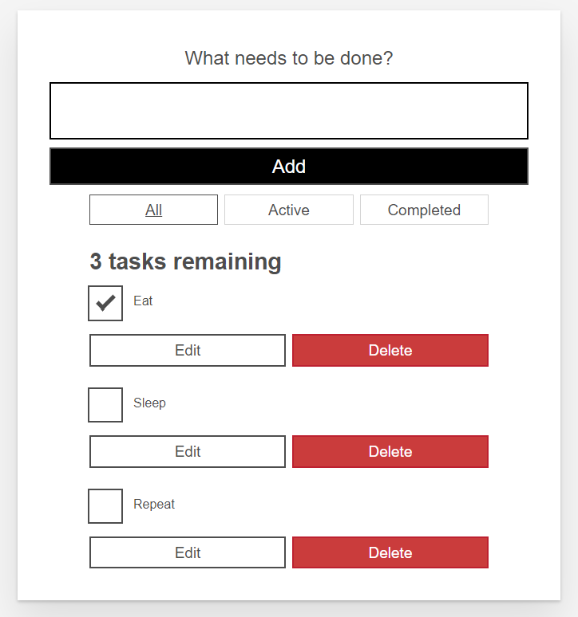
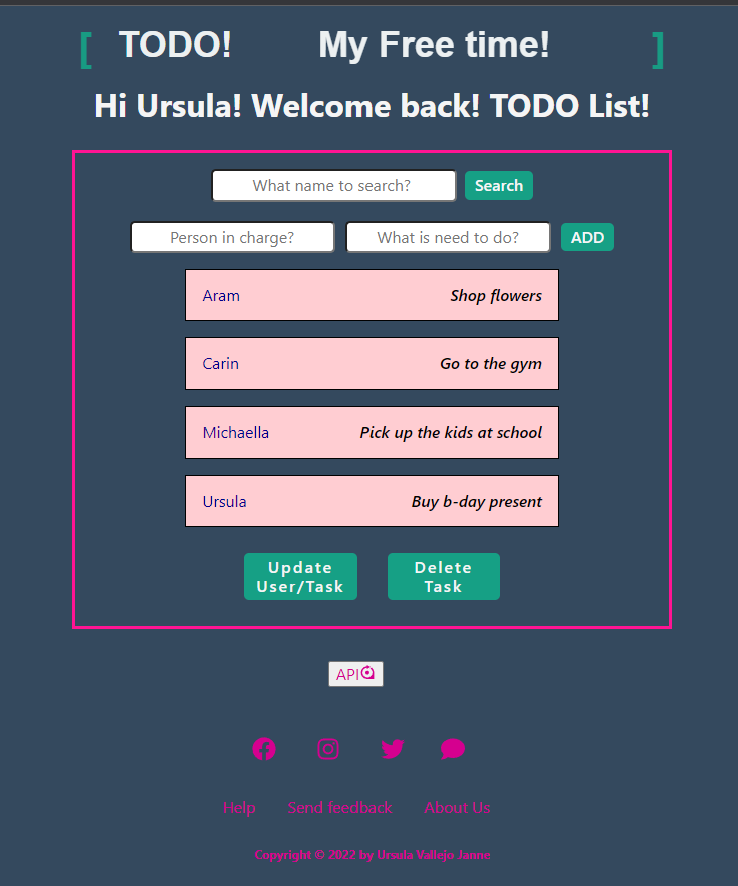
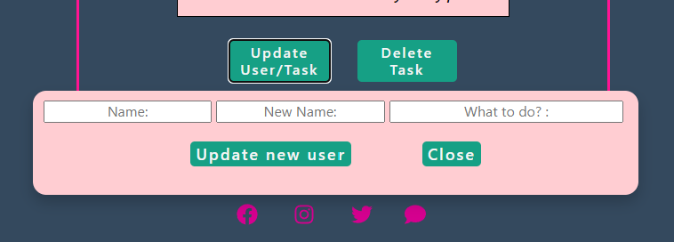
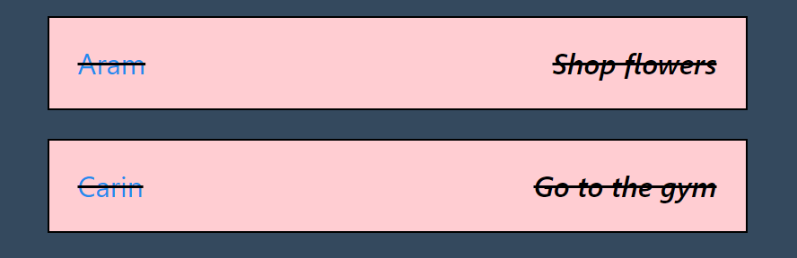
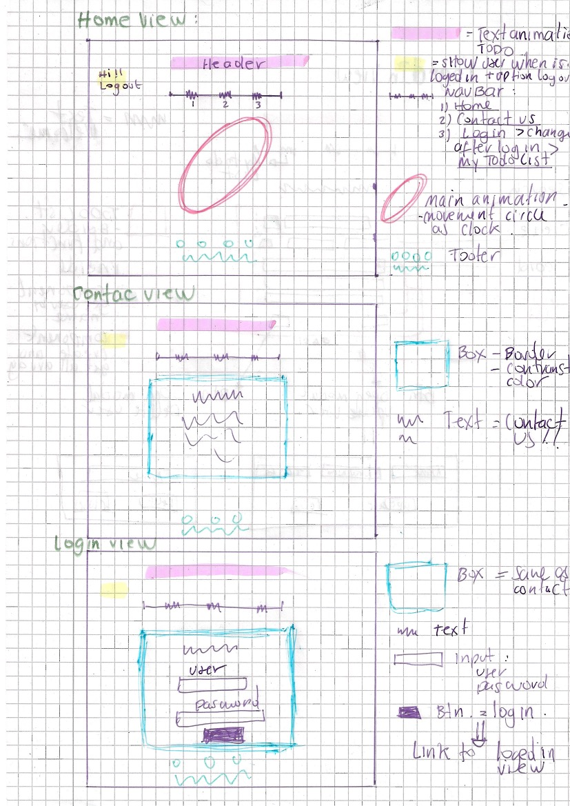
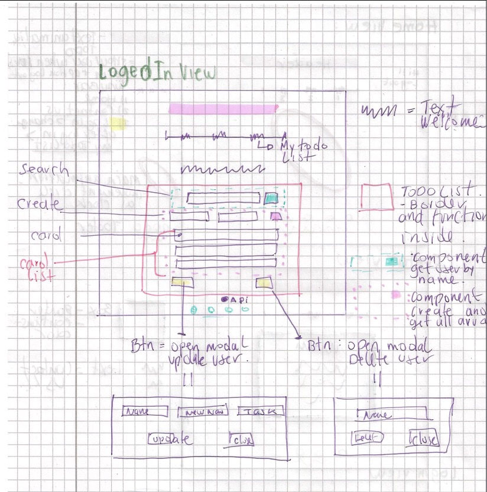
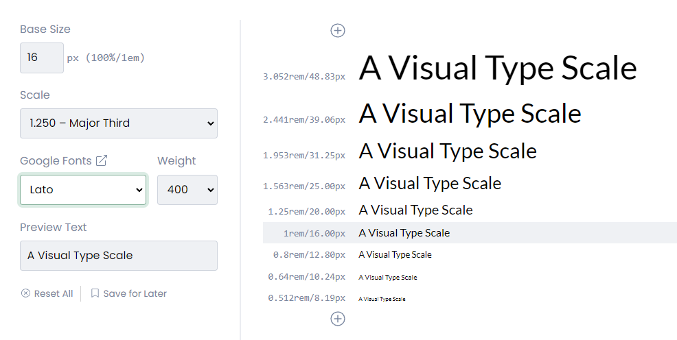
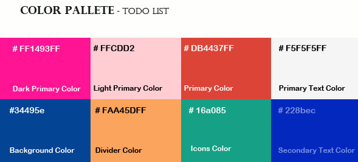
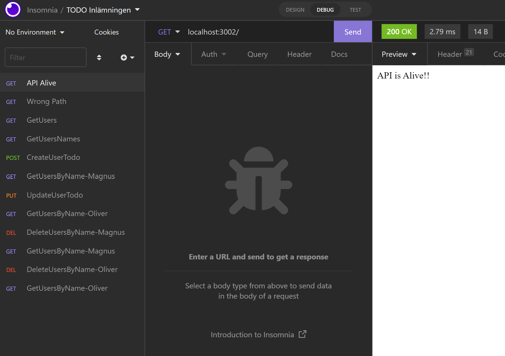
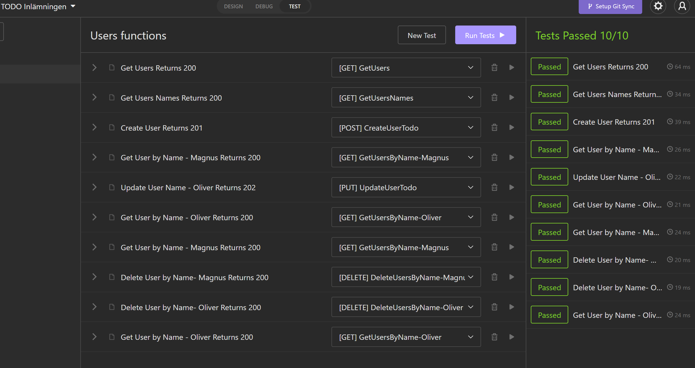

### Detailed information on the process of the project below:

# CONTENT:

- [1. General Projektplan](#1-general-projektplan-)
- [2. UX](#2-ux-)

  - [A. Prototype](#a-prototyp)
  - [B. Font](#b-font-)
  - [C. ColorSchema](#c-colorschema)

- [3. Projektgenomförande](#3-projektgenomfrande-)

  - [Functionen i projekten](#funcionen-i-projekten)
  - [Tester](#tester)
  - [Nya koncept](#nya-koncept)
  - [Svårigheter](#svrigheter)
  - [Konklusionen](#konklusionen)

# 1. General Projektplan :

In the Web Server Programming 1 project, it consists of two parts: generating a backend and from there developing the content for a TODO version.

The first part to be done was the backend, and the frontend implementation has been done in React.

In the assignment delivery folder, you can see a folder corresponding to the backend, but for the frontend there are 2 versions:

- a simple one that covers the essential part of the deliverable.
- and there is a second file where you can find the idea I developed, including a user.
  Later I will explain why these two versions exist.

Part of the project is to have a project development plan whose components are broken down in Trello.

You can see my project plan at the link below:

[Trello Web Page](https://trello.com/b/kmUZDY4f/webbserverprogrammering-1)

Each file has a README where you can see the various packages that were installed. Here is a summary:

## Install the following npm packages in my project:

```shell
BACKEND:
   npm init --y
   npm install
   npm install cors express dotenv
   npm install -D nodemon
   Middlewares:
   npm install helmet morgan
   Tests:
   npm install -D mocha chai chai-http

FRONTEND:
   npm install react-icons
   npm install axios
   npm install tachyons@4.12.0
   npm install react-router-dom@6
```

<details>
<summary> # Getting Started with Create React App </summary>

This project was bootstrapped with [Create React App](https://github.com/facebook/create-react-app).

## Available Scripts

In the project directory, you can run:

### `npm start`

Runs the app in the development mode.
Open [http://localhost:3000](http://localhost:3000) to view it in your browser.

The page will reload when you make changes.
You may also see any lint errors in the console.

### `npm test`

Launches the test runner in the interactive watch mode.
See the section about [running tests](https://facebook.github.io/create-react-app/docs/running-tests) for more information.

### `npm run build`

Builds the app for production to the `build` folder.
It correctly bundles React in production mode and optimizes the build for the best performance.

The build is minified and the filenames include the hashes.
Your app is ready to be deployed!

See the section about [deployment](https://facebook.github.io/create-react-app/docs/deployment) for more information.

### `npm run eject`

**Note: this is a one-way operation. Once you `eject`, you can't go back!**

If you aren't satisfied with the build tool and configuration choices, you can `eject` at any time. This command will remove the single build dependency from your project.

Instead, it will copy all the configuration files and the transitive dependencies (webpack, Babel, ESLint, etc.) right into your project so you have full control over them. All of the commands except `eject` will still work, but they will point to the copied scripts so you can tweak them. At this point you're on your own.

You don't have to ever use `eject`. The curated feature set is suitable for small and medium deployments, and you shouldn't feel obligated to use this feature. However, we understand that this tool wouldn't be useful if you couldn't customize it when you are ready for it.

## Learn More

You can learn more in the [Create React App documentation](https://facebook.github.io/create-react-app/docs/getting-started).
To learn React, check out the [React documentation](https://reactjs.org/).

### Code Splitting

This section has moved here: [https://facebook.github.io/create-react-app/docs/code-splitting](https://facebook.github.io/create-react-app/docs/code-splitting)

### Analyzing the Bundle Size

This section has moved here: [https://facebook.github.io/create-react-app/docs/analyzing-the-bundle-size](https://facebook.github.io/create-react-app/docs/analyzing-the-bundle-size)

### Making a Progressive Web App

This section has moved here: [https://facebook.github.io/create-react-app/docs/making-a-progressive-web-app](https://facebook.github.io/create-react-app/docs/making-a-progressive-web-app)

### Advanced Configuration

This section has moved here: [https://facebook.github.io/create-react-app/docs/advanced-configuration](https://facebook.github.io/create-react-app/docs/advanced-configuration)

### Deployment

This section has moved here: [https://facebook.github.io/create-react-app/docs/deployment](https://facebook.github.io/create-react-app/docs/deployment)

### `npm run build` fails to minify

This section has moved here: [https://facebook.github.io/create-react-app/docs/troubleshooting#npm-run-build-fails-to-minify](https://facebook.github.io/create-react-app/docs/troubleshooting#npm-run-build-fails-to-minify)

</details>

# 2. UX :

The idea is that there is a login page and after logging in the user can see their TODO list.

To make it more dynamic, it was proposed that the layout should have animations.
The most important is the feeling of time passing, for which there is a circle that moves like a clock hand when it turns around and marks the passage of time.

The approach is that the user accesses the website with login where they can see their information from the to-do list.
As if it were a time-management application for personal use or for your family or workgroup.

The basic idea for content management that I wanted to implement was based on each element being able to handle all functions such as updating, deleting, and moving to different lists. The model is as follows:



- [Mozilla DEV: Todo list](https://developer.mozilla.org/en-US/docs/Learn/Tools_and_testing/Client-side_JavaScript_frameworks/React_todo_list_beginning)
- [Mozilla DEV: Todo list](https://mdn.github.io/todo-react-build/)

I found it difficult to implement because I could not get the backend to work there. Therefore, I chose the following layout to handle data, where there are two buttons that open a modal where the different procedures can be performed.





Use CSS to mark the task as complete. By clicking on each task, a line is marked for it.



For the animations I wanted to implement, use resources from CodePen.

- For the title text use:

  - [Codepen: Text animation](https://codepen.io/yoannhel/pen/DMzjog)

- For the circles on the main page I rely on:

  - [Codepen: Nougat animation](https://codepen.io/stevn/pen/ZOKdjm)

[https://codepen.io/stevn/pen/ZOKdjm](https://codepen.io/stevn/pen/ZOKdjm)

## A. Prototype:

The development of wireframes for the project was done in low fidelity. Since the project is not complex, I chose to only develop this sketch.





## B. Font :

For this project, I chose to use only two typefaces so that it would be visually clean and without too much visual information. I chose a more geometric font because it has to do with a to-do list, which is more automated (related to organizational charts).

The typefaces I chose were:

1. Lato / Header
   
2. The default system typeface for the body since they have the technical appearance that also worked in my project:

```css
font-family: -apple-system, BlinkMacSystemFont, 'Segoe UI', 'Roboto', 'Oxygen',
  'Ubuntu', 'Cantarell', 'Fira Sans', 'Droid Sans', 'Helvetica Neue', sans-serif;
```

Links:

- [Type-Scale](https://type-scale.com/)

## C. ColorSchema:

The base color method is deep blue, which is related to visual calm, but I chose to use contrasting colors to create a layout with a more modern look, young, for which contrast colors such as pink, emerald green, and white are used as the basis for fonts and information on the page. (animation of vibrant primary colors).

Also use black for the text in the Todo.

## Final Color Palette:

Here is the color palette I used in the project:



# 3. Projektgenomförande:

Below I describe the process I had to develop the project.

## Functionen i projekten:

The simple project consists of only one page where the functions in the backend are reflected. These are:

- Alive: to confirm if there is a connection to the API.
  In the lower part, leave it available via an icon for this delivery project to be able to verify that this function has been executed. In a single-user version, this should not be included.

### CRUD:

**GET:**

- Get Todo Data: retrieves the information of existing data in the array.
- Get User Data by Name: finds a user in the array and returns the whole object.
- Get all users: exists in the backend but is not used in the frontend because it only gives names and not user details.

**POST:**

- Create Todo: allows creating a new user and a task assigned to them.

**PUT:**

- Update User Todo: allows modifying an existing user in the array, giving them another name and modifying the task.

**DELETE:**

- Delete User: removes a user by name, which removes the entire object in the array.

To be able to do the backend part, I had to watch the class video several times to, for example, understand the role of middleware and how the elements are connected. It took some work for me, but in the end, I could get them working.

## Tester:

In the project, both frontend and backend have been tested, as we can see below:

**Backend:**

In the Backend folder you will find the Insomnia test file.





<details>
<summary> # Backend Tests in Terminal </summary>

> backend\@1.0.0 start
> npx nodemon src/server.js

\[nodemon] 2.0.15
\[nodemon] to restart at any time, enter `rs`
\[nodemon] watching path(s): _._
\[nodemon] watching extensions: js,mjs,json
\[nodemon] starting `node src/server.js`
server running on address: port [http://localhost:3002](http://localhost:3002)
Middleware function is running and printing "Banana" to console
\::1 - - \[09/Mar/2022:14:59:18 +0000] "GET /getAllTodos HTTP/1.1" 200 209
Middleware function is running and printing "Banana" to console
\::ffff:127.0.0.1 - - \[09/Mar/2022:16:11:24 +0000] "GET /getAllTodos HTTP/1.1" 200 209
Middleware function is running and printing "Banana" to console
\::ffff:127.0.0.1 - - \[09/Mar/2022:16:11:24 +0000] "GET /getUserNames/name HTTP/1.1" 200 73
Middleware function is running and printing "Banana" to console
\::ffff:127.0.0.1 - - \[09/Mar/2022:16:11:24 +0000] "POST /createTodo/ HTTP/1.1" 201 255
Middleware function is running and printing "Banana" to console
\::ffff:127.0.0.1 - - \[09/Mar/2022:16:11:24 +0000] "GET /getUserByName/Magnus HTTP/1.1" 200 45
Middleware function is running and printing "Banana" to console
\::ffff:127.0.0.1 - - \[09/Mar/2022:16:11:24 +0000] "PUT /updateTodoDataByName/ HTTP/1.1" 202 40
Middleware function is running and printing "Banana" to console
\::ffff:127.0.0.1 - - \[09/Mar/2022:16:11:24 +0000] "GET /getUserByName/Oliver HTTP/1.1" 200 40
Middleware function is running and printing "Banana" to console
\::ffff:127.0.0.1 - - \[09/Mar/2022:16:12:05 +0000] "GET / HTTP/1.1" 200 14
Terminate batch job (Y/N)? y
PS C:\Git_projects\WEB_2108\WebbserverProgrammering_1\Todo_uppgifter\backend> npm test

> backend\@1.0.0 test
> mocha 'tests/\*\*'

server running on address: port [http://localhost:3002](http://localhost:3002)
w787kb

TESTING API ALIVE ROUTES
Testing a route that does not exist
Middleware function is running and printing "Banana" to console
\::ffff:127.0.0.1 - - \[09/Mar/2022:16:14:42 +0000] "GET /randomUrl HTTP/1.1" 404 13711
√ should expect 404 not found
Test a route that does exist
Middleware function is running and printing "Banana" to console
\::ffff:127.0.0.1 - - \[09/Mar/2022:16:14:42 +0000] "GET / HTTP/1.1" 200 14
√ should expect 200 OK
Testing a route that does not exist with expect
Middleware function is running and printing "Banana" to console
\::ffff:127.0.0.1 - - \[09/Mar/2022:16:14:42 +0000] "GET /randomUrl HTTP/1.1" 404 13711
√ should expect 404 not found
Test a route that does exist with expect
Middleware function is running and printing "Banana" to console
\::ffff:127.0.0.1 - - \[09/Mar/2022:16:14:42 +0000] "GET / HTTP/1.1" 200 14
√ should expect 200 OK

TESTING USER API ALIVE ROUTES
Testing a route that does not exist with expect
Middleware function is running and printing "Banana" to console
\::ffff:127.0.0.1 - - \[09/Mar/2022:16:14:42 +0000] "GET /w787kb HTTP/1.1" 404 13705
√ should expect 404 not found
Testing to get an array of users (GET)
Middleware function is running and printing "Banana" to console
\::ffff:127.0.0.1 - - \[09/Mar/2022:16:14:42 +0000] "GET /getAllTodos HTTP/1.1" 200 209
√ should expect an array of users to be returned
Testing to get an array of users (GET) with expect
Middleware function is running and printing "Banana" to console
\::ffff:127.0.0.1 - - \[09/Mar/2022:16:14:42 +0000] "GET /getAllTodos HTTP/1.1" 200 209
√ should expect an array of users to be returned with expect
Testing to get an array of users names (GET) with expect
Middleware function is running and printing "Banana" to console
\::ffff:127.0.0.1 - - \[09/Mar/2022:16:14:42 +0000] "GET /getUserNames/name HTTP/1.1" 200 73

Terminate batch job (Y/N)? y
PS C:\Git_projects\WEB_2108\WebbserverProgrammering_1\Todo_uppgifter\backend> npm test

> backend\@1.0.0 test
> mocha 'tests/\*\*'

server running on address: port [http://localhost:3002](http://localhost:3002)
pgsim5

TESTING API ALIVE ROUTES
Testing a route that does not exist
Middleware function is running and printing "Banana" to console
\::ffff:127.0.0.1 - - \[09/Mar/2022:16:19:42 +0000] "GET /randomUrl HTTP/1.1" 404 13711
√ should expect 404 not found
Test a route that does exist
Middleware function is running and printing "Banana" to console
\::ffff:127.0.0.1 - - \[09/Mar/2022:16:19:42 +0000] "GET / HTTP/1.1" 200 14
√ should expect 200 OK
Testing a route that does not exist with expect
Middleware function is running and printing "Banana" to console
\::ffff:127.0.0.1 - - \[09/Mar/2022:16:19:42 +0000] "GET /randomUrl HTTP/1.1" 404 13711
√ should expect 404 not found
Test a route that does exist with expect
Middleware function is running and printing "Banana" to console
\::ffff:127.0.0.1 - - \[09/Mar/2022:16:19:42 +0000] "GET / HTTP/1.1" 200 14
√ should expect 200 OK

TESTING USER API ALIVE ROUTES
Testing a route that does not exist with expect
Middleware function is running and printing "Banana" to console
\::ffff:127.0.0.1 - - \[09/Mar/2022:16:19:42 +0000] "GET /pgsim5 HTTP/1.1" 404 13705
√ should expect 404 not found
Testing to get an array of users (GET)
Middleware function is running and printing "Banana" to console
\::ffff:127.0.0.1 - - \[09/Mar/2022:16:19:42 +0000] "GET /getAllTodos HTTP/1.1" 200 209
√ should expect an array of users to be returned
Testing to get an array of users (GET) with expect
Middleware function is running and printing "Banana" to console
\::ffff:127.0.0.1 - - \[09/Mar/2022:16:19:42 +0000] "GET /getAllTodos HTTP/1.1" 200 209
√ should expect an array of users to be returned with expect
Testing to get an array of user names (GET) with expect
Middleware function is running and printing "Banana" to console
\::ffff:127.0.0.1 - - \[09/Mar/2022:16:19:42 +0000] "GET /getUserNames/name HTTP/1.1" 200 73
√ should expect an array of user names with expect
Testing message on user that does not exist with expect
Middleware function is running and printing "Banana" to console
\::ffff:127.0.0.1 - - \[09/Mar/2022:16:19:42 +0000] "GET /getUserByName/Magnus HTTP/1.1" 200 35
√ should return a string
Testing to update a user (PUT) with expect
Middleware function is running and printing "Banana" to console
\::ffff:127.0.0.1 - - \[09/Mar/2022:16:19:42 +0000] "PUT /updateTodoDataByName/ HTTP/1.1" 202 35
√ should expect an error string
Testing and creating a user with a task (POST) with expect
Middleware function is running and printing "Banana" to console
\::ffff:127.0.0.1 - - \[09/Mar/2022:16:19:42 +0000] "POST /createTodo/ HTTP/1.1" 201 255
√ should expect a user to be created with a task
Testing to get a user object (GET) with expect
Middleware function is running and printing "Banana" to console
\::ffff:127.0.0.1 - - \[09/Mar/2022:16:19:42 +0000] "GET /getUserByName/Magnus HTTP/1.1" 200 45
√ should expect a user to be created with a task
Testing and creating a user with a task (POST) with expect
Middleware function is running and printing "Banana" to console
\::ffff:127.0.0.1 - - \[09/Mar/2022:16:19:42 +0000] "PUT /updateTodoDataByName/ HTTP/1.1" 202 40
√ should expect a user to be created with a task
Testing message on user that does not exist with expect
Middleware function is running and printing "Banana" to console
\::ffff:127.0.0.1 - - \[09/Mar/2022:16:19:42 +0000] "GET /getUserByName/Magnus HTTP/1.1" 200 35
√ should return a string
Testing to delete a user by name that does not exist in db (DELETE) with expect
Middleware function is running and printing "Banana" to console
\::ffff:127.0.0.1 - - \[09/Mar/2022:16:19:42 +0000] "DELETE /deleteTodoDataByName/Magnus HTTP/1.1" 200 52
√ should expect a string with fail message
Testing and deleting a user with a task (DELETE) with Expect
Middleware function is running and printing "Banana" to console
\::ffff:127.0.0.1 - - \[09/Mar/2022:16:19:42 +0000] "DELETE /deleteTodoDataByName/Oliver HTTP/1.1" 200 51
√ should expect a user to be deleted with the task
Testing to delete a user by name that does not exist in db (DELETE) with expect
Middleware function is running and printing "Banana" to console
\::ffff:127.0.0.1 - - \[09/Mar/2022:16:19:42 +0000] "DELETE /deleteTodoDataByName/Magnus HTTP/1.1" 200 52
√ should expect a string with fail message

17 passing (103ms)

</details>

**Frontend:**

- todo-frontend-LogIn

```shell
Test Suites: 4 passed, 4 total
Tests:       6 passed, 6 total
Snapshots:   0 total
Time:        2.169 s
```

- todo-frontend-simple

```shell
Test Suites: 4 passed, 4 total
Tests:       6 passed, 6 total
Snapshots:   0 total
Time:        2.133 s
Ran all test suites.
```

## Nya koncept:

Most of the content we used for backend was quite new to me. The npm packages we install for middleware are completely new and I still find it difficult to understand the specific functions of:

- Helmet
- Cors
- Morgan
- Express

The other test packages in Backend are also new:

- Mocha
- Chai
- Chai-http

## Svårigheter:

1. The first difficulty I had was that when I entered the page I wanted the entire array to be reflected; for this I found a solution with useEffect.

```js
useEffect(() => {
  fetchDataFromExternalApi()
}, [])
```

2. A difficulty I found was getting the functions I created in different components to communicate with each other and update the information displayed in the frontend. The functions worked when I made changes in the backend, but for example if I updated a user I did not see it reflected immediately in my component where that data was displayed. The internet with props calls the function but in the version I wanted to develop originally the information only appears after logging in, on update it was removed from that user and created a bug.

The first solution I found to update the information is to reload the page, which on a page that is actually functional is not the best solution, but for the project I implemented it:

```js
function refreshPage() {
  window.location.reload()
}
```

For this reason, I have decided to make a simple version of the project where the requirements for the assignment will be covered and continue trying to solve the difficulty of reloading with the user.

3. To solve this, try implementing a context so that it can show me the information; it updates when there is a change in data.

4. When I ran the tests in the frontend I got an error in the terminal which a colleague explained to me was because the app.test file had no content. Removing it solved that problem.

## Konklusionen

I think my initial planning was more complex than I first thought. Even though I have had difficulties, I believe it has helped me to get a more global context of the possibilities to handle data and functions in the backend and not just rely on the frontend for this handling.
The simple version is to fulfill the class project, but personally I would like to complete the implementation shortly with all the features I found by making a separate to-do list that has already been done, which is pending among other possibilities.

It seemed like a good starting point to understand the relationship with the API, but I think it would have been interesting to see how a more complex frontend implementation could be done.

When the project is finished, I realize that I must review how to generate the content structure in the backend part again because it seemed complicated for me.

I was able to do it by watching class videos several times, but developing them from scratch is very complex.
