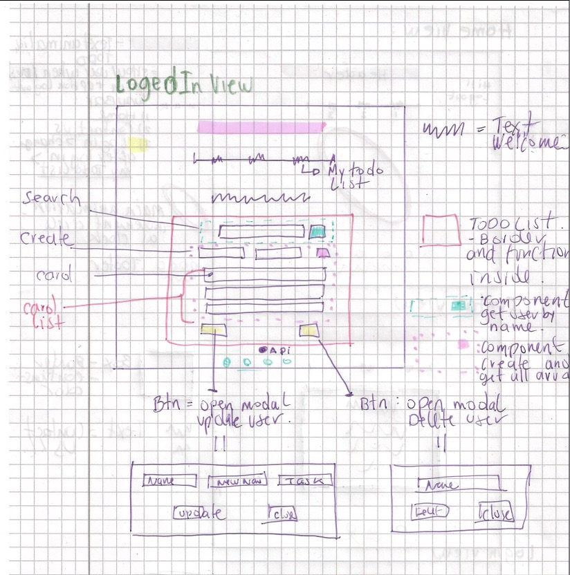

### Mars 2022
## Project realized by Ursula Vallejo Janne for the Course WebbserverProgrammering 1.
### React / JS / Css / Backend: Express-cors-dotenv / Middlewares: helmet-morgan / Test: Moca- MocaChai-ChaiHttp


https://user-images.githubusercontent.com/89070768/207939206-5d5d975a-8e34-4e0a-971e-6e4fed8e452b.mp4


###  Detailed information on the process of the project below:


# CONTENT:


- [1. General Projektplan](#1-general-projektplan-)
- [2. UX](#2-ux-)
    - [A. Prototyp](#a-prototyp)
    - [B. Font](#b-font-)
    - [C. ColorSchema](#c-colorschema)
- [3. Projektgenomförande](#3-projektgenomfrande-)
    - [ Funcionen i projekten ](#funcionen-i-projekten)
    - [ Tester](#tester)
    - [ Nya koncept ](#nya-koncept)
    - [ Svårigheter ](#svrigheter)
    - [ Konklusionen](#konklusionen)


# 1. General Projektplan :

I WebbserverProgrammering 1 projektet består av två delar, generera en backend och därifrån utveckla innehållet i en version av TODO.

Den första delen som skulle göras var backend och frontend-implementeringen har gjorts i Rect.

I uppgiftsleveransmappen kan du se en mapp som motsvarar backend men för frontend finns det 2 versioner: 
-en enkel som täcker den väsentliga delen av leveransen.
-och det finns en andra fil där du kan hitta idén som du utvecklade inklusive en användare.
Senare kommer jag att förklara varför dessa två versioner finns.

En del av projektet är att ha en projektutvecklingsplan vars beståndsdelar är nedbrutna i Trello.

Du kan se mitt projektplan i länken nedan:

[Trello Webbsida ](https://trello.com/b/kmUZDY4f/webbserverprogrammering-1)

Varje fil har en README där du kan se de olika paketen som installerades. Här är en sammanfattning:

## Installera följande npm paket i min projekt:

```shell
BACKEND:
   npm init --y
   npm install 
   npm install cors express dotenv
   npm install -D nodemon
   Middlewares:
   npm install helmet morgan
   Tests:
   npm install -D mocha chai chai-http
   
FRONTEND:
   npm install react-icons
   npm install axios
   npm install tachyons@4.12.0
   npm install react-router-dom@6
   
```

<details>
<summary> # Getting Started with Create React App </summary>

This project was bootstrapped with [Create React App](https://github.com/facebook/create-react-app).

## Available Scripts

In the project directory, you can run:

### `npm start`

Runs the app in the development mode.\
Open [http://localhost:3000](http://localhost:3000) to view it in your browser.

The page will reload when you make changes.\
You may also see any lint errors in the console.

### `npm test`

Launches the test runner in the interactive watch mode.\
See the section about [running tests](https://facebook.github.io/create-react-app/docs/running-tests) for more information.

### `npm run build`

Builds the app for production to the `build` folder.\
It correctly bundles React in production mode and optimizes the build for the best performance.

The build is minified and the filenames include the hashes.\
Your app is ready to be deployed!

See the section about [deployment](https://facebook.github.io/create-react-app/docs/deployment) for more information.

### `npm run eject`

**Note: this is a one-way operation. Once you `eject`, you can't go back!**

If you aren't satisfied with the build tool and configuration choices, you can `eject` at any time. This command will remove the single build dependency from your project.

Instead, it will copy all the configuration files and the transitive dependencies (webpack, Babel, ESLint, etc) right into your project so you have full control over them. All of the commands except `eject` will still work, but they will point to the copied scripts so you can tweak them. At this point you're on your own.

You don't have to ever use `eject`. The curated feature set is suitable for small and middle deployments, and you shouldn't feel obligated to use this feature. However we understand that this tool wouldn't be useful if you couldn't customize it when you are ready for it.

## Learn More

You can learn more in the [Create React App documentation](https://facebook.github.io/create-react-app/docs/getting-started).

To learn React, check out the [React documentation](https://reactjs.org/).

### Code Splitting

This section has moved here: [https://facebook.github.io/create-react-app/docs/code-splitting](https://facebook.github.io/create-react-app/docs/code-splitting)

### Analyzing the Bundle Size

This section has moved here: [https://facebook.github.io/create-react-app/docs/analyzing-the-bundle-size](https://facebook.github.io/create-react-app/docs/analyzing-the-bundle-size)

### Making a Progressive Web App

This section has moved here: [https://facebook.github.io/create-react-app/docs/making-a-progressive-web-app](https://facebook.github.io/create-react-app/docs/making-a-progressive-web-app)

### Advanced Configuration

This section has moved here: [https://facebook.github.io/create-react-app/docs/advanced-configuration](https://facebook.github.io/create-react-app/docs/advanced-configuration)

### Deployment

This section has moved here: [https://facebook.github.io/create-react-app/docs/deployment](https://facebook.github.io/create-react-app/docs/deployment)

### `npm run build` fails to minify

This section has moved here: [https://facebook.github.io/create-react-app/docs/troubleshooting#npm-run-build-fails-to-minify](https://facebook.github.io/create-react-app/docs/troubleshooting#npm-run-build-fails-to-minify)

</details>


# 2. UX :

Tanken är att det finns en login sida och efter användaren kan se ut hens TODOlist.

För att göra det mer dynamiskt föreslogs att layouten skulle ha animationer. 
Den viktigaste är känslan av tidens gång för vilken det finns en cirkel som rör sig som klockans visare när de vänder sig om och markerar tidens gång.

Tillvägagångssättet är att användaren kommer åt webbsidan med inloggning där han kan se sin information från att göra-listan. 
Som om det vore en tidshanteringsapplikation för personligt bruk eller för din familj eller arbetsgrupp.

Grund ide med content management som jag ville implementera var baserad på att varje element kunde hantera alla funktioner som att uppdatera, ta bort och flytta till olika listor. Modellen är som följer:


- [Mozilla DEV: Todo list](https://developer.mozilla.org/en-US/docs/Learn/Tools_and_testing/Client-side_JavaScript_frameworks/React_todo_list_beginning)
- [Mozilla DEV: Todo list](https://mdn.github.io/todo-react-build/)

Jag tyckte att det var svårt att implementera det eftersom jag inte kunde få backend att fungera där. Välj därför följande layout för att hantera data, där det finns två knappar som öppnar en modal där de olika procedurerna kan utföras.


Använd CSS för att markera uppgiften som klar. Genom att klicka på varje uppgift markeras en rad för den.


För animationerna som jag ville implementera, använd resurserna från CodePen.

-För rubriktiteln ta:
- [Codepen: Text animation](https://codepen.io/yoannhel/pen/DMzjog)

- För cirklarna på huvudsidan litar jag på:
- [Codepen: Nougat animation](https://codepen.io/stevn/pen/ZOKdjm)

https://codepen.io/stevn/pen/ZOKdjm

## A. Prototyp:

Utvecklingen av Wireframes för projektet utvecklades i Low Fidelity, eftersom projektet inte är komplext, så valde jag att bara utveckla den här skissen.





## B. Font :

För det här projektet valde jag att endast använda två typefaces så att det skulle bli visuellt rent och utan mycket visuell information. Jag valde ett mer geometriskt typsnitt för vad det har att göra med en att göra-lista som är mer automatisk (relaterat till organisationsscheman).

Typeface jag valde var följande:

1. Lato / Header
   
2. De förinställda typeface som finns på body som standard eftersom de har det tekniska utseendet som också fungerade i mitt projekt:
```shell

 font-family: -apple-system, BlinkMacSystemFont, 'Segoe UI', 'Roboto', 'Oxygen',
    'Ubuntu', 'Cantarell', 'Fira Sans', 'Droid Sans', 'Helvetica Neue',
    sans-serif;

```

Länkar:
- [Type-Scale](https://type-scale.com/)

## C. ColorSchema: 

Grund färgs metoden är djupblå som är relaterad till visuellt lugn men jag valde att använda kontrasterande färger för att skapa en layout med en mer modern look, ung, för vilken kontrastfärger som rosa, smaragdgrön och vit används grund för fonts och informationen på sidan. (animering av livliga primärfärger).

Använd även färgen svart för texten i Todo.

##Final Color Palette:

Här färgskalan jag använde i projektet:


# 3. Projektgenomförande :

Sedan berättar jag processen jag var tvungen att utveckla projektet.

## Funcionen i projekten:

Det enkla projektet består av endast en sida där funktionerna som finns i backend reflekteras. Dessa är:

- Alive :för att bekräfta om det finns en anslutning till API:et.
  I den nedre delen, lämna den tillgänglig via en ikon för detta leveransprojekt för att kunna verifiera att denna funktion har utförts. I en enda användarversion bör detta inte inkluderas.

### CRUD:

*GET:

- Get Todo Data: tar med sig informationen om befintlig data i arrayen.
- Get User Data by Name : Hitta en användare i arrayen, och returnerar hela objektet.
- Get all users:det finns i backend men använd det inte i frontend eftersom det bara ger namnen och inte användaruppgifterna.

*POST:

- Create Todo: ger möjlighet att skapa en ny användare och en uppgift som tilldelas honom.

*PUT:

- Update User Todo: ger möjlighet att modifiera en befintlig användare i arrayen, ge den ett annat namn och modifiera task.

*DELETE:

_ Delete User: Ta bort en användare med namnet som tar bort allt objekt i arrayen.

För att kunna göra backend-delen var jag tvungen att titta på klassvideon flera gånger för att till exempel kunna förstå vad mellanvaran hade för funktion och hur elementen hänger ihop. Det tog lite arbete för mig men till slut kunde jag få dem att fungera.

## Tester:

I projektet har både frontend och backend testats, vilket vi kan se nedan:

* Backend:

  I Backend-mappen hittar du Insomnia-testfilen.

  

  

<details>
<summary> # Backend Tests i Terminal </summary>

> backend@1.0.0 start
> npx nodemon src/server.js

[nodemon] 2.0.15
[nodemon] to restart at any time, enter `rs`
[nodemon] watching path(s): *.*
[nodemon] watching extensions: js,mjs,json
[nodemon] starting `node src/server.js`
server running on address: port http://localhost:3002
Middleware function is running and printing "Banana" to console
::1 - - [09/Mar/2022:14:59:18 +0000] "GET /getAllTodos HTTP/1.1" 200 209
Middleware function is running and printing "Banana" to console
::ffff:127.0.0.1 - - [09/Mar/2022:16:11:24 +0000] "GET /getAllTodos HTTP/1.1" 200 209
Middleware function is running and printing "Banana" to console
::ffff:127.0.0.1 - - [09/Mar/2022:16:11:24 +0000] "GET /getUserNames/name HTTP/1.1" 200 73
Middleware function is running and printing "Banana" to console
::ffff:127.0.0.1 - - [09/Mar/2022:16:11:24 +0000] "POST /createTodo/ HTTP/1.1" 201 255
Middleware function is running and printing "Banana" to console
::ffff:127.0.0.1 - - [09/Mar/2022:16:11:24 +0000] "GET /getUserByName/Magnus HTTP/1.1" 200 45
Middleware function is running and printing "Banana" to console
::ffff:127.0.0.1 - - [09/Mar/2022:16:11:24 +0000] "PUT /updateTodoDataByName/ HTTP/1.1" 202 40
Middleware function is running and printing "Banana" to console
::ffff:127.0.0.1 - - [09/Mar/2022:16:11:24 +0000] "GET /getUserByName/Oliver HTTP/1.1" 200 40
Middleware function is running and printing "Banana" to console
::ffff:127.0.0.1 - - [09/Mar/2022:16:12:05 +0000] "GET / HTTP/1.1" 200 14
Terminate batch job (Y/N)? y
PS C:\Git_projects\WEB_2108\WebbserverProgrammering_1\Todo_uppgifter\backend> npm test

> backend@1.0.0 test
> mocha 'tests/**'

server running on address: port http://localhost:3002
w787kb


TESTING API ALIVE ROUTES
Testing a route that does not exist
Middleware function is running and printing "Banana" to console
::ffff:127.0.0.1 - - [09/Mar/2022:16:14:42 +0000] "GET /randomUrl HTTP/1.1" 404 13711
√ should expect 404 not found
Test a route that does exists
Middleware function is running and printing "Banana" to console
::ffff:127.0.0.1 - - [09/Mar/2022:16:14:42 +0000] "GET / HTTP/1.1" 200 14
√ should expect 200 OK
Testing a route that does not exist with expect
Middleware function is running and printing "Banana" to console
::ffff:127.0.0.1 - - [09/Mar/2022:16:14:42 +0000] "GET /randomUrl HTTP/1.1" 404 13711
√ should expect 404 not found
Test a route that does exists with expect
Middleware function is running and printing "Banana" to console
::ffff:127.0.0.1 - - [09/Mar/2022:16:14:42 +0000] "GET / HTTP/1.1" 200 14
√ should expect 200 OK

TESTING USER API ALIVE ROUTES
Testing a route that does not exist with expect
Middleware function is running and printing "Banana" to console
::ffff:127.0.0.1 - - [09/Mar/2022:16:14:42 +0000] "GET /w787kb HTTP/1.1" 404 13705
√ should expect 404 not found
Testing to get an array of users (GET)
Middleware function is running and printing "Banana" to console
::ffff:127.0.0.1 - - [09/Mar/2022:16:14:42 +0000] "GET /getAllTodos HTTP/1.1" 200 209
√ should expect a array of users to be returned
Testing to get an array of users (GET) with expect
Middleware function is running and printing "Banana" to console
::ffff:127.0.0.1 - - [09/Mar/2022:16:14:42 +0000] "GET /getAllTodos HTTP/1.1" 200 209
√ should expect a array of users to be returned with expect
Testing to get an array of users names (GET) with expect
Middleware function is running and printing "Banana" to console
::ffff:127.0.0.1 - - [09/Mar/2022:16:14:42 +0000] "GET /getUserNames/name HTTP/1.1" 200 73

Terminate batch job (Y/N)? y
PS C:\Git_projects\WEB_2108\WebbserverProgrammering_1\Todo_uppgifter\backend> npm test

> backend@1.0.0 test
> mocha 'tests/**'

server running on address: port http://localhost:3002
pgsim5


TESTING API ALIVE ROUTES
Testing a route that does not exist
Middleware function is running and printing "Banana" to console
::ffff:127.0.0.1 - - [09/Mar/2022:16:19:42 +0000] "GET /randomUrl HTTP/1.1" 404 13711
√ should expect 404 not found
Test a route that does exists
Middleware function is running and printing "Banana" to console
::ffff:127.0.0.1 - - [09/Mar/2022:16:19:42 +0000] "GET / HTTP/1.1" 200 14
√ should expect 200 OK
Testing a route that does not exist with expect
Middleware function is running and printing "Banana" to console
::ffff:127.0.0.1 - - [09/Mar/2022:16:19:42 +0000] "GET /randomUrl HTTP/1.1" 404 13711
√ should expect 404 not found
Test a route that does exists with expect
Middleware function is running and printing "Banana" to console
::ffff:127.0.0.1 - - [09/Mar/2022:16:19:42 +0000] "GET / HTTP/1.1" 200 14
√ should expect 200 OK

TESTING USER API ALIVE ROUTES
Testing a route that does not exist with expect
Middleware function is running and printing "Banana" to console
::ffff:127.0.0.1 - - [09/Mar/2022:16:19:42 +0000] "GET /pgsim5 HTTP/1.1" 404 13705
√ should expect 404 not found
Testing to get an array of users (GET)
Middleware function is running and printing "Banana" to console
::ffff:127.0.0.1 - - [09/Mar/2022:16:19:42 +0000] "GET /getAllTodos HTTP/1.1" 200 209
√ should expect a array of users to be returned
Testing to get an array of users (GET) with expect
Middleware function is running and printing "Banana" to console
::ffff:127.0.0.1 - - [09/Mar/2022:16:19:42 +0000] "GET /getAllTodos HTTP/1.1" 200 209
√ should expect a array of users to be returned with expect
Testing to get an array of users names (GET) with expect
Middleware function is running and printing "Banana" to console
::ffff:127.0.0.1 - - [09/Mar/2022:16:19:42 +0000] "GET /getUserNames/name HTTP/1.1" 200 73
√ should expect a array of user names with expect
Testing message on user that does not exists with expect
Middleware function is running and printing "Banana" to console
::ffff:127.0.0.1 - - [09/Mar/2022:16:19:42 +0000] "GET /getUserByName/Magnus HTTP/1.1" 200 35
√ should return a string
Testing to update a user (PUT) with expect
Middleware function is running and printing "Banana" to console
::ffff:127.0.0.1 - - [09/Mar/2022:16:19:42 +0000] "PUT /updateTodoDataByName/ HTTP/1.1" 202 35
√ should expect a error string
Testing and create a user with a task (POST) with expect
Middleware function is running and printing "Banana" to console
::ffff:127.0.0.1 - - [09/Mar/2022:16:19:42 +0000] "POST /createTodo/ HTTP/1.1" 201 255
√ should expect a user to be created with a task
Testing to get an user object (GET) with expect
Middleware function is running and printing "Banana" to console
::ffff:127.0.0.1 - - [09/Mar/2022:16:19:42 +0000] "GET /getUserByName/Magnus HTTP/1.1" 200 45
√ should expect a user to be created with a task
Testing and create a user with a task (POST)with expect
Middleware function is running and printing "Banana" to console
::ffff:127.0.0.1 - - [09/Mar/2022:16:19:42 +0000] "PUT /updateTodoDataByName/ HTTP/1.1" 202 40
√ should expect a user to be created with a task
Testing message on user that does not exists with expect
Middleware function is running and printing "Banana" to console
::ffff:127.0.0.1 - - [09/Mar/2022:16:19:42 +0000] "GET /getUserByName/Magnus HTTP/1.1" 200 35
√ should return a string
Testing to delete a user by name that do not exist in db (DELETE) with expect
Middleware function is running and printing "Banana" to console
::ffff:127.0.0.1 - - [09/Mar/2022:16:19:42 +0000] "DELETE /deleteTodoDataByName/Magnus HTTP/1.1" 200 52
√ should expect a string with fail message
Testing and delete a user with a task (DELETE) with Expect
Middleware function is running and printing "Banana" to console
::ffff:127.0.0.1 - - [09/Mar/2022:16:19:42 +0000] "DELETE /deleteTodoDataByName/Oliver HTTP/1.1" 200 51
√ should expect a user to be deleted with the task
Testing to delete a user by name that do not exist in db (DELETE) with expect
Middleware function is running and printing "Banana" to console
::ffff:127.0.0.1 - - [09/Mar/2022:16:19:42 +0000] "DELETE /deleteTodoDataByName/Magnus HTTP/1.1" 200 52
√ should expect a string with fail message


17 passing (103ms)
</details>

* Frontend:

-todo-frontend-LogIn
```shell

Test Suites: 4 passed, 4 total
Tests:       6 passed, 6 total
Snapshots:   0 total
Time:        2.169 s

```

-todo-frontend-simple
```shell
Test Suites: 4 passed, 4 total
Tests:       6 passed, 6 total
Snapshots:   0 total
Time:        2.133 s
Ran all test suites.

```

## Nya koncept:

Det mesta av innehållet vi använde för backend var ganska nytt för mig. npm-paketen som vi installerar för mellanvarorna är helt nya och jag har fortfarande svårt att förstå de specifika funktionerna hos dessa:
- Helmet
- Cors
- Morgan
- Express

De andra testpaketen i Backend är också nya:
- Mocha 
- Chai 
- Chai-http

## Svårigheter:

1.Den första svårigheten jag hade var att när jag gick in på sidan ville jag att hela arrayen skulle reflekteras, för detta hittade jag en lösning med useEffect.

```shell
   useEffect(() => {
        fetchDataFromExternalApi()
    }, [])

```
2.En svårighet som jag hittade är att kunna få funktionerna som jag skapar olika komponenter med att kommunicera med varandra och uppdatera informationen som presenterades i frontend. Funktionerna fungerade när jag gjorde ändringarna i backend, men om jag till exempel uppdaterade en användare såg jag det inte reflekterat direkt i min komponent där den datan visades. Internet med rekvisita kallar funktionen men som i versionen som jag ville utveckla från början syns informationen efter att man gjort en användarinloggning, vid uppdatering togs den bort från den användaren och skapade en bugg.

Den första lösningen som jag hittade för att uppdatera informationen är att göra en omladdning på sidan, vilket på en sida som faktiskt är funktionell inte är den bästa lösningen men för projektet implementerade jag den:


```shell
   function refreshPage() {
        window.location.reload();
    }

```
Av denna anledning har jag bestämt mig för att göra en enkel version av projektet där kraven för uppgiften kommer att täckas och fortsätta att försöka lösa svårigheten att ladda om med användaren.

3.För att lösa detta, försök implementera ett context så att det kan visa mig informationen, den uppdateras när det sker en förändring i data.

4.   När jag gjorde testerna i frontend fick jag ett fel i terminalen som en kollega förklarade för mig var för att app.test-filen inte hade något innehåll. Att ta bort det löste det här problemet.

## Konklusionen

Jag tror att min första planering var mer komplex än vad jag först hade trott. Även om jag har haft svårigheter, tror jag att det har hjälpt mig att få en mer global kontext av möjligheterna att hantera data och funktioner i backend och inte bara beroende av frontend för denna hantering.
Den enkla versionen är för att uppfylla klassprojektet men personligen skulle jag vilja kunna slutföra implementeringen på kort tid av alla funktioner som jag hittade med att göra en separat lista över att göra som redan har gjorts, som väntar bland andra möjligheter.

Det verkade som en bra utgångspunkt för att förstå relationen med API:t, men jag tror att det hade varit intressant att se hur en mer komplex frontend implementering kunde göras.

När projektet är klart inser jag att jag måste se över hur man genererar innehållsstrukturen i backend-delen igen eftersom det verkade komplicerat för mig.

Jag kunde göra det genom att titta på klassvideorna flera gånger, men att utveckla dem från grunden är väldigt komplicerat.
